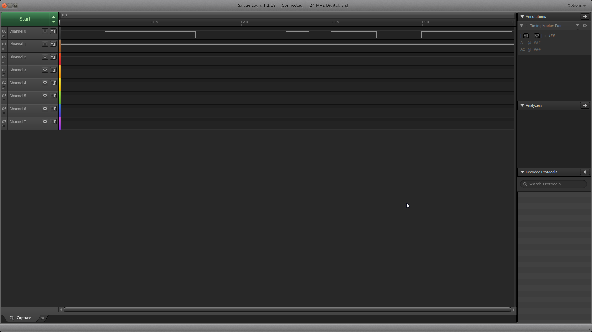
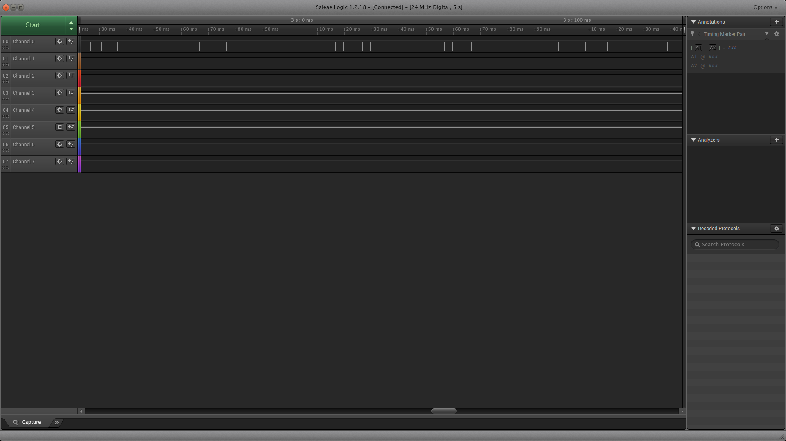
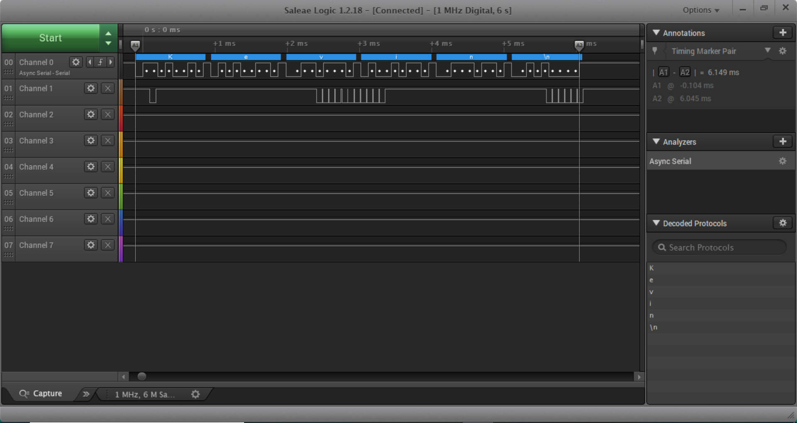
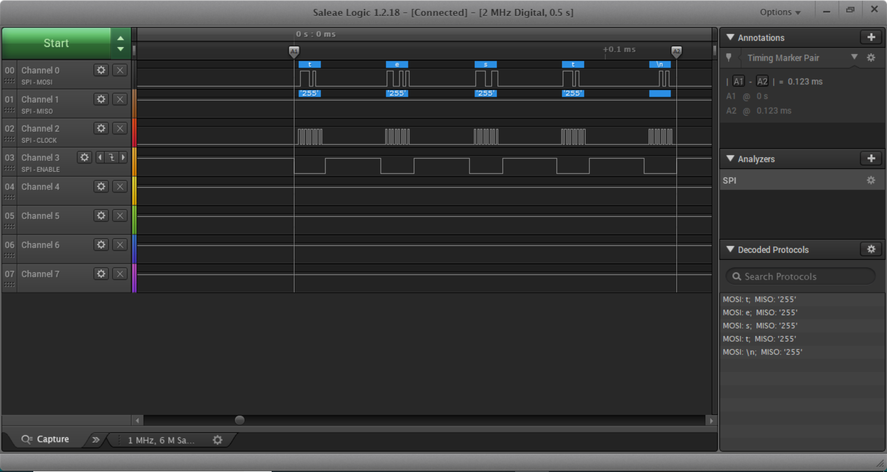

Name: Masaad Khan
    
EID: mak4668

Team Number: F9

## Questions

1. Why does your program need a setup and a loop?

    Without the setup, the code would not initialize values, we need the loop in order to constantly run the code.

2. What is the downside to putting all your code in a loop?

    Sometimes you don't want all your code to be rewritten over and over again. If there are redundant initializations in the     code, they will be done multiple times which would be more than needed. 

3. Why does your code need to be compiled?

    If the code is not complied, we will not know if there are errors in the code itself (syntax). We also need it to compile       so that it is converted into something that the microcontroller understands.

4. When lowering the frequency in procedure A, step 4, what is going wrong? Brainstorm some solutions. Dimmers exist in the real world. What is their solution?

    When we reduce the frequency in procedure A, we make it so that the LED is not being updated as much as should be to look     like a consistent glow. Dimmers usually keep a higher frequency in order to make sure the color doesn't flash.

5. Why do you need to connect the logic analyzer ground to the ESP32 ground?

    In order to close the circuit. If you don't connect it to the ground you won't be able to see the signals from the           controller.

6. What is the difference between synchronous and asynchronous communication?
    
    Synchronous works specifically with the clock. Asynchronous does not depend on the clock.

7. Profile of UART: Sent X bytes in Y time 

    Sent 6 bytes in 6.149 ms

8. Profile of SPI: Sent X bytes in Y time

    Sent 5 bytes in .123 ms

9. Why is SPI so much faster than UART?
    SPI is faster than UART because it uses more wires, therefore, allows for more data to flow at the same time.
    

10. list one pro and one con of UART

    UART is asynchronous, however, it is slow.

11. list one pro and one con of SPI

    SPI is fast, however, it is only for synchronous devices (devices with clocks).

12. list one pro and one con of I2C

    Doesn't need as many wires to use as SPI, however, they can create more complexity in the design.

13. Why does I2C need external resistors to work?

    So that it doesn't get blown up.

## Screenshots

Procedure A, step 1:

Procedure A, step 4:

Procedure B, UART:

Procedure B, SPI:

